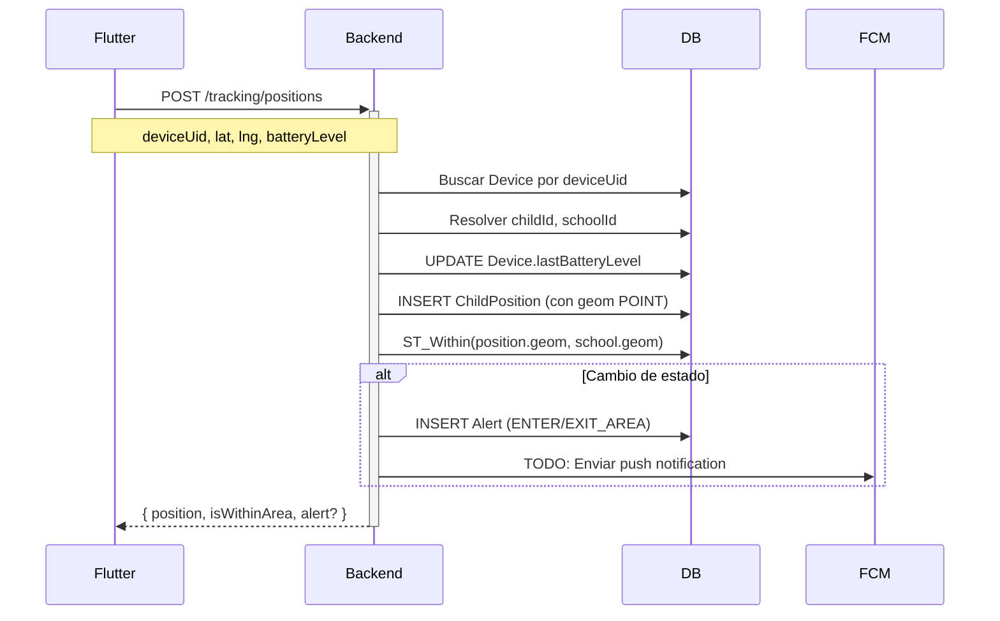

# 📊 Estado Actual del Backend - Geofencing

## ✅ Backend MVP Completado

### 🔹 Stack Tecnológico
- **NestJS 11.0.1** - Framework backend
- **Prisma 6.16.1** - ORM para PostgreSQL
- **PostgreSQL + PostGIS** - Base de datos con extensión espacial
- **JWT** - Autenticación y autorización
- **bcrypt** - Encriptación de contraseñas

### 🔹 Arquitectura
- **Multi-tenant** por `schoolId`
- **Role-based access** (SCHOOL_ADMIN, PARENT)
- **Geofencing automático** con PostGIS ST_Within
- **Alertas automáticas** al entrar/salir del área segura

---

## 📦 Modelos Implementados

### School
```typescript
{
  id: number
  name: string
  address?: string
  phone?: string
  status: Status
  geom?: geometry(POLYGON, 4326)  // PostGIS
}
```
✅ Sin campo `code` - identificación por `id`
✅ Geometría del área segura en PostGIS

### User
```typescript
{
  id: number
  schoolId: number
  email: string (unique por school)
  password: string (hashed)
  fullName: string
  phone?: string
  role: UserRole  // SCHOOL_ADMIN | PARENT
  status: Status
}
```

### Child
```typescript
{
  id: number
  schoolId: number
  parentId: number
  fullName: string
  age?: number        // ✅ NUEVO
  grade?: string
  status: Status
}
```

### Device
```typescript
{
  id: number
  schoolId: number
  childId?: number
  deviceUid: string (unique)  // ✅ AndroidId / IDFV / UUID
  name?: string               // "Celular de Pedrito"
  model?: string              // ✅ "Samsung Galaxy A13"
  manufacturer?: string       // ✅ "Samsung"
  osVersion?: string          // ✅ "Android 14"
  platform?: string           // "android" | "ios"
  lastBatteryLevel?: number   // ✅ 0-100
  fcmToken?: string
  status: Status
  lastSeen?: DateTime
}
```
✅ Cambio crítico: `deviceId` → `deviceUid`
✅ Campos de hardware para Flutter

### ChildPosition
```typescript
{
  id: number
  schoolId: number
  childId: number
  lat: number
  lng: number
  accuracy?: number
  speed?: number
  heading?: number
  altitude?: number
  batteryLevel?: number       // ✅ NUEVO
  geom?: geometry(POINT, 4326) // PostGIS
  createdAt: DateTime
}
```

### Alert
```typescript
{
  id: number
  schoolId: number
  childId: number
  positionId: number
  type: AlertType  // ENTER_AREA | EXIT_AREA
  message: string
  isRead: boolean
  readAt?: DateTime
  createdAt: DateTime
}
```

---

## 🎯 Endpoints Implementados (53 rutas)

### 🔐 Auth
- `POST /api/auth/login` - Login JWT
- `GET /api/auth/me` - Perfil usuario

### 🏫 Schools
- `POST /api/schools` - Crear colegio
- `GET /api/schools` - Listar colegios
- `GET /api/schools/:id` - Ver detalle
- `PATCH /api/schools/:id` - Actualizar
- `DELETE /api/schools/:id` - Eliminar

### 👥 Users
- `POST /api/users` - Crear usuario
- `GET /api/users` - Listar usuarios del colegio
- `GET /api/users/:id` - Ver usuario
- `PATCH /api/users/:id` - Actualizar
- `DELETE /api/users/:id` - Eliminar

### 👶 Children
- `POST /api/children` - Crear hijo
- `GET /api/children` - Listar hijos del colegio
- `GET /api/children/my-children` - Hijos del padre logueado
- `GET /api/children/:id` - Ver hijo
- `PATCH /api/children/:id` - Actualizar
- `DELETE /api/children/:id` - Eliminar

### 📱 Devices
- `POST /api/devices` - Registrar dispositivo
- `POST /api/devices/link` - Vincular dispositivo ↔ hijo
- `GET /api/devices` - Listar dispositivos
- `GET /api/devices/:id` - Ver dispositivo
- `PATCH /api/devices/:id` - Actualizar
- `DELETE /api/devices/:id` - Eliminar

### 📍 Tracking (核心)
- `POST /api/tracking/positions` - **Enviar posición GPS (público)**
- `GET /api/tracking/child/:childId/last` - Última posición
- `GET /api/tracking/child/:childId/history` - Historial
- `GET /api/tracking/school/all-positions` - Todas las posiciones

### 🚨 Alerts
- `GET /api/alerts` - Todas las alertas del colegio
- `GET /api/alerts/my-alerts` - Alertas del padre logueado
- `GET /api/alerts/unread-count` - Contador no leídas
- `GET /api/alerts/:id` - Ver alerta
- `PATCH /api/alerts/:id/mark-read` - Marcar como leída
- `PATCH /api/alerts/mark-all-read` - Marcar todas leídas

---

## 🔥 Flujo de Geofencing (Core)



---

## 🧪 Smoke Tests (PowerShell)

### Flujo completo con `deviceUid`:

```powershell
# 1. Crear colegio
$school = Invoke-RestMethod -Uri "http://localhost:3000/api/schools" `
  -Method POST -ContentType "application/json" `
  -Body '{"name":"Colegio San Martín","address":"Av. Principal 123"}'

# 2. Crear admin
$admin = Invoke-RestMethod -Uri "http://localhost:3000/api/users" `
  -Method POST -ContentType "application/json" `
  -Body '{
    "schoolId":1,
    "email":"admin@sanmartin.edu",
    "password":"admin123",
    "fullName":"Juan Pérez",
    "role":"SCHOOL_ADMIN"
  }'

# 3. Login
$auth = Invoke-RestMethod -Uri "http://localhost:3000/api/auth/login" `
  -Method POST -ContentType "application/json" `
  -Body '{"email":"admin@sanmartin.edu","password":"admin123"}'
$token = $auth.accessToken

# 4. Crear padre
$parent = Invoke-RestMethod -Uri "http://localhost:3000/api/users" `
  -Method POST -ContentType "application/json" `
  -Headers @{ Authorization = "Bearer $token" } `
  -Body '{
    "schoolId":1,
    "email":"padre@gmail.com",
    "password":"padre123",
    "fullName":"María García",
    "role":"PARENT"
  }'

# 5. Crear hijo (con age)
$child = Invoke-RestMethod -Uri "http://localhost:3000/api/children" `
  -Method POST -ContentType "application/json" `
  -Headers @{ Authorization = "Bearer $token" } `
  -Body '{
    "schoolId":1,
    "parentId":2,
    "fullName":"Pedrito García",
    "age":8,
    "grade":"3ro Primaria"
  }'

# 6. Registrar dispositivo
$device = Invoke-RestMethod -Uri "http://localhost:3000/api/devices" `
  -Method POST -ContentType "application/json" `
  -Headers @{ Authorization = "Bearer $token" } `
  -Body '{
    "schoolId":1,
    "deviceUid":"android-abc123-unique-id",
    "name":"Celular de Pedrito",
    "model":"Samsung Galaxy A13",
    "manufacturer":"Samsung",
    "osVersion":"Android 14",
    "platform":"android",
    "fcmToken":"fcm-token-ejemplo"
  }'

# 7. Vincular dispositivo ↔ hijo
$link = Invoke-RestMethod -Uri "http://localhost:3000/api/devices/link" `
  -Method POST -ContentType "application/json" `
  -Headers @{ Authorization = "Bearer $token" } `
  -Body '{"deviceUid":"android-abc123-unique-id","childId":1}'

# 8. Enviar posición (público - desde Flutter)
$position = Invoke-RestMethod -Uri "http://localhost:3000/api/tracking/positions" `
  -Method POST -ContentType "application/json" `
  -Body '{
    "deviceUid":"android-abc123-unique-id",
    "lat":-17.783,
    "lng":-63.182,
    "accuracy":10,
    "speed":0,
    "batteryLevel":85
  }'

Write-Host "✅ Posición guardada: $($position.position.id)"
Write-Host "📍 Dentro del área: $($position.isWithinArea)"
if ($position.alert) {
  Write-Host "🚨 Alerta generada: $($position.alert.type)"
}
```

---

## 🎯 Próximos Pasos

### 🟣 A. Endpoints optimizados para apps

Crear endpoints "view models" que devuelvan data ya armada:

```typescript
// GET /api/me/children
{
  children: [
    {
      id: 1,
      fullName: "Pedrito García",
      age: 8,
      grade: "3ro Primaria",
      device: {
        name: "Celular de Pedrito",
        batteryLevel: 85,
        lastSeen: "2025-11-23T12:30:00Z"
      },
      lastPosition: {
        lat: -17.783,
        lng: -63.182,
        isInsideSchool: true,
        timestamp: "2025-11-23T12:29:45Z"
      }
    }
  ]
}

// GET /api/children/:id/tracking/history?from=2025-11-23&to=2025-11-24
{
  positions: [
    {
      lat: -17.783,
      lng: -63.182,
      batteryLevel: 85,
      timestamp: "2025-11-23T12:29:45Z"
    },
    // ...
  ]
}
```

### 🟢 B. Flutter (App Móvil)

**Módulos necesarios:**
- `device_info_plus` - Obtener deviceUid, model, manufacturer
- `battery_plus` - Nivel de batería
- `geolocator` - GPS tracking
- `workmanager` - Background location tracking
- `shared_preferences` - Guardar deviceUid localmente

**Flujo:**
1. Primera vez: Registrar device con `deviceUid`
2. Vincular device al hijo
3. Background service envía posiciones cada X minutos
4. App de padres: Ver mapa con ubicación + batería + alertas

### 🟡 C. QGIS - Dibujar áreas seguras

1. Conectar QGIS a PostgreSQL
2. Cargar capa `schools` (geometría POLYGON)
3. Dibujar polígonos en `geom` para cada colegio
4. Ver capa `child_positions` en tiempo real

### 🔵 D. Panel Admin (React + Axios)

- Dashboard con mapa de todos los niños
- Gestión de usuarios, colegios, hijos
- Visualización de alertas
- Reportes de historial

---

## 🚀 Estado: LISTO PARA INTEGRACIÓN

✅ Backend MVP funcional  
✅ Schema alineado con Flutter  
✅ PostGIS configurado  
✅ Autenticación JWT  
✅ Multi-tenant  
✅ Documentación completa  
✅ Código en GitHub (rama `dev`)

**Siguiente milestone:** Flutter app + QGIS polygons
